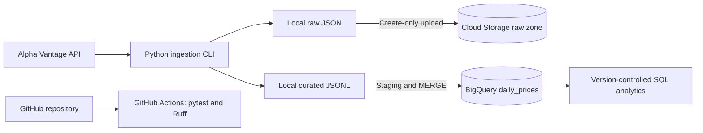

# MarketPulse

[](https://github.com/Leila163/gcp-market-data-platform/actions/workflows/ci.yml)

MarketPulse is an educational cloud data engineering project for collecting,
validating, transforming, and analyzing US equity market data.

The project uses Lam Research Corporation (`LRCX`) as an anchor for exploring
historical market behavior and future portfolio analytics. It is designed to
grow incrementally.

## Architecture



Cloud Storage uploads and BigQuery loads are automated through the optional
`--upload-raw` and `--load-bigquery` CLI flags. The flags can be used
independently or together.

## Cloud data design

| Layer | Current implementation |
| --- | --- |
| Raw | Private Cloud Storage bucket in `us-central1`, Standard storage, uniform bucket-level access, public access prevention, and create-only object uploads |
| Curated | BigQuery dataset in the `US` multi-region with strict JSONL staging loads |
| Table | `daily_prices`, partitioned by `trading_date` and clustered by `symbol` |
| Upsert | Idempotent `MERGE` using `symbol`, `trading_date`, and `source` as the business key |
| Analytics | Version-controlled GoogleSQL with dry-run cost validation |

## Running the pipeline

Install the project and development dependencies:

```powershell
python -m pip install -e ".[dev]"
```

Run a local ingestion:

```powershell
marketpulse ingest-daily LRCX
```

Run an ingestion with an automated raw upload to Cloud Storage:

```powershell
marketpulse ingest-daily LRCX --upload-raw
```

Run an ingestion with an idempotent BigQuery load:

```powershell
marketpulse ingest-daily LRCX --load-bigquery
```

Run both cloud operations:

```powershell
marketpulse ingest-daily LRCX --upload-raw --load-bigquery
```

Cloud operations require Application Default Credentials and the appropriate
`GCP_PROJECT_ID`, `GCS_RAW_BUCKET`, and BigQuery environment settings. Copy
`.env.example` to `.env` and keep all real credentials out of version control.

## Project goals

* Ingest daily stock-market data from an external API.
* Preserve raw API responses using create-only writes.
* Validate symbols, API responses, schemas, and data types.
* Build analytical models for returns, volatility, and drawdown.
* Compare hypothetical portfolio allocations without exposing private holdings.
* Deploy a scheduled pipeline on Google Cloud.
* Provision cloud infrastructure reproducibly with Terraform.
* Validate code and infrastructure through GitHub Actions.

## Current status

BigQuery automation milestone completed:

* Tested Alpha Vantage extraction and API error handling.
* Secure environment-based configuration using secret types.
* Typed transformation of daily OHLCV data.
* Immutable local raw-response writes and curated JSONL output.
* Tested Cloud Storage adapter with create-only upload protection.
* Automated raw uploads through the `--upload-raw` CLI option.
* Strict BigQuery staging loads using an explicit eight-field schema.
* Idempotent warehouse upserts through a staging-table `MERGE`.
* Automated BigQuery loading through the `--load-bigquery` CLI option.
* Staging-table cleanup after successful and failed warehouse operations.
* Live validation produced 103 unique LRCX records with no duplicate business keys.
* Repeating the same curated load affected zero warehouse rows.
* Automated pytest, Ruff lint, and Ruff formatting checks in GitHub Actions.

## Next milestone

* Provision Cloud Storage and BigQuery resources with Terraform.
* Package the ingestion pipeline for a managed Google Cloud runtime.
* Schedule ingestion after infrastructure and integration tests pass.
* Add freshness, completeness, and duplicate-key data-quality checks.
* Expand analytics to return, volatility, drawdown, and diversification metrics.

## Privacy

Actual holdings, API keys, downloaded market data, and private configuration
files are excluded from version control. Public examples will use market data
or synthetic portfolio allocations without exposing personal holdings.

## Disclaimer

This project is for education and analytical experimentation. It does not
provide investment advice or recommendations to buy or sell securities.
