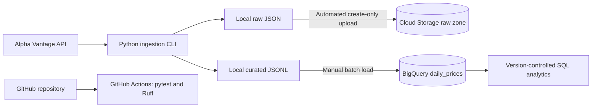

# MarketPulse

[](https://github.com/Leila163/gcp-market-data-platform/actions/workflows/ci.yml)

MarketPulse is an educational cloud data engineering project for collecting,
validating, transforming, and analyzing US equity market data.

The project uses Lam Research Corporation (`LRCX`) as an anchor for exploring
historical market behavior and future portfolio analytics. It is designed to
grow incrementally.

## Architecture



Raw Cloud Storage uploads are automated through the optional `--upload-raw`
CLI flag. BigQuery loading remains a manual bootstrap operation and will be
automated in the next milestone.

## Cloud data design

| Layer     | Current implementation                                                                                                                                 |
| --------- | ------------------------------------------------------------------------------------------------------------------------------------------------------ |
| Raw       | Private Cloud Storage bucket in `us-central1`, Standard storage, uniform bucket-level access, public access prevention, and create-only object uploads |
| Curated   | BigQuery dataset in the `US` multi-region                                                                                                              |
| Table     | `daily_prices`, partitioned by `trading_date` and clustered by `symbol`                                                                                |
| Analytics | Version-controlled GoogleSQL with dry-run cost validation                                                                                              |

## Running the pipeline

Install the project and development dependencies:

```powershell
python -m pip install -e ".[dev]"
```

Run a local ingestion:

```powershell
marketpulse ingest-daily LRCX
```

Run an ingestion with an automated raw upload to Cloud Storage:

```powershell
marketpulse ingest-daily LRCX --upload-raw
```

Cloud uploads require Application Default Credentials and the
`GCP_PROJECT_ID` and `GCS_RAW_BUCKET` environment settings. Copy
`.env.example` to `.env` and keep all real credentials out of version control.

## Project goals

* Ingest daily stock-market data from an external API.
* Preserve raw API responses using create-only writes.
* Validate symbols, API responses, schemas, and data types.
* Build analytical models for returns, volatility, and drawdown.
* Compare hypothetical portfolio allocations without exposing private holdings.
* Deploy a scheduled pipeline on Google Cloud.
* Provision cloud infrastructure reproducibly with Terraform.
* Validate code and infrastructure through GitHub Actions.

## Current status

Cloud Storage automation milestone completed:

* Tested Alpha Vantage extraction and API error handling.
* Secure environment-based configuration using secret types.
* Typed transformation of daily OHLCV data.
* Immutable local raw-response writes and curated JSONL output.
* Tested Python Cloud Storage adapter using a generation-match precondition to prevent overwrites.
* Automated raw uploads through the `--upload-raw` CLI option.
* Live cloud validation with matching local and Cloud Storage MD5 checksums.
* BigQuery table containing 100 validated LRCX daily-price records.
* Reusable BigQuery JSON schema and analytical SQL.
* Automated pytest, Ruff lint, and Ruff formatting checks in GitHub Actions.

## Next milestone

* Add a tested BigQuery Python adapter.
* Automate curated warehouse loads with idempotent job behavior.
* Provision cloud resources with Terraform.
* Schedule ingestion after local and cloud integration tests pass.
* Expand the analytical layer to portfolio return, volatility, and diversification metrics.

## Privacy

Actual holdings, API keys, downloaded market data, and private configuration
files are excluded from version control. Public examples will use market data
or synthetic portfolio allocations without exposing personal holdings.

## Disclaimer

This project is for education and analytical experimentation. It does not
provide investment advice or recommendations to buy or sell securities.
