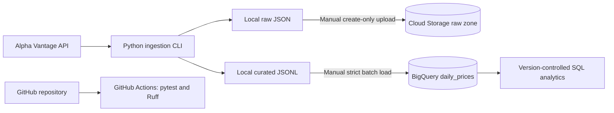

# MarketPulse

MarketPulse is an educational cloud data engineering project for collecting,
validating, transforming, and analyzing US equity market data.

The project uses Lam Research Corporation (`LRCX`) as an anchor for exploring
historical market behavior and future portfolio analytics. It is designed to
grow incrementally.

## Architecture

The cloud transfer and load steps are currently manual bootstrap operations.
The next milestone will automate them through tested Python adapters.

## Cloud data design

| Layer | Current implementation |
| --- | --- |
| Raw | Private Cloud Storage bucket in `us-central1`, Standard storage, uniform bucket-level access, and public access prevention |
| Curated | BigQuery dataset in the `US` multi-region |
| Table | `daily_prices`, partitioned by `trading_date` and clustered by `symbol` |
| Analytics | Version-controlled GoogleSQL with dry-run cost validation |

## Project goals

- Ingest daily stock-market data from an external API.
- Preserve raw API responses using create-only writes.
- Validate symbols, API responses, schemas, and data types.
- Build analytical models for returns, volatility, and drawdown.
- Compare hypothetical portfolio allocations without exposing private holdings.
- Deploy a scheduled pipeline on Google Cloud.
- Provision cloud infrastructure reproducibly with Terraform.
- Validate code and infrastructure through GitHub Actions.

## Current status

Cloud foundation milestone completed:

- Tested Alpha Vantage extraction and API error handling.
- Secure environment-based configuration using secret types.
- Typed transformation of daily OHLCV data.
- Immutable local raw-response writes and curated JSONL output.
- Private Cloud Storage raw zone with a checksum-verified LRCX object.
- BigQuery table containing 100 validated LRCX daily-price records.
- Reusable BigQuery JSON schema and analytical SQL.
- Automated pytest, Ruff lint, and Ruff formatting checks in GitHub Actions.

## Next milestone

- Add tested Google Cloud Storage and BigQuery Python adapters.
- Automate raw uploads and curated warehouse loads.
- Make repeated pipeline runs idempotent.
- Provision resources with Terraform.
- Schedule ingestion after local and cloud integration tests pass.

## Privacy

Actual holdings, API keys, downloaded market data, and private configuration
files are excluded from version control. Public examples will use market data
or synthetic portfolio allocations without exposing personal holdings.

## Disclaimer

This project is for education and analytical experimentation. It does not
provide investment advice or recommendations to buy or sell securities.
